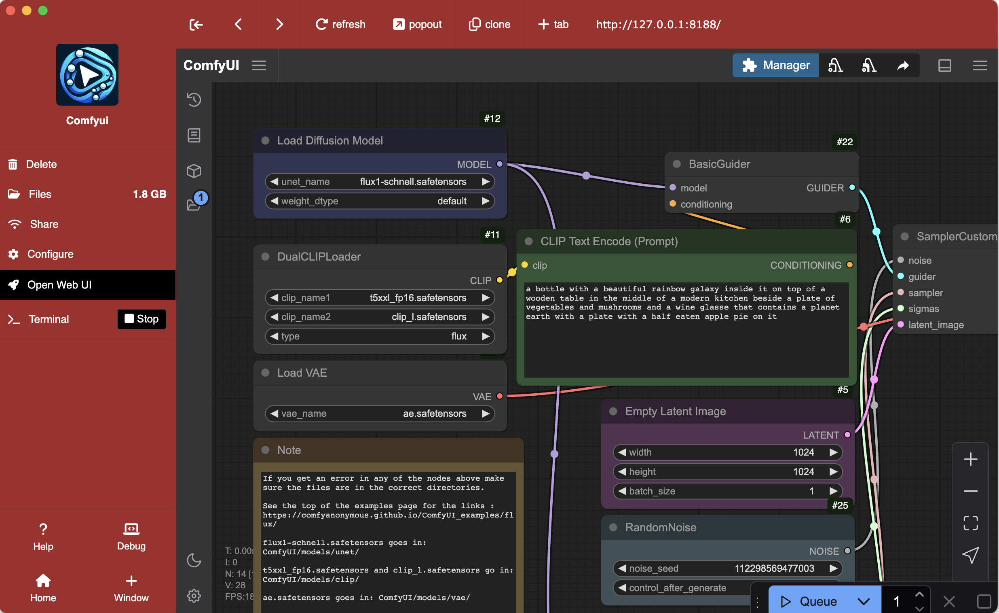
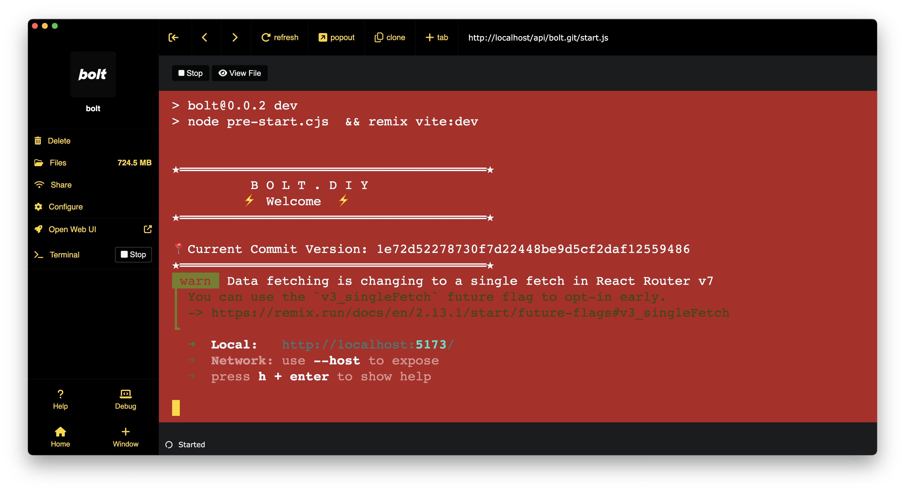

# PSP

> Pinokio System Programming


# Install

## 1. One-Click Install

**(Recommended)** Install this through https://pinokio.computer

1. Get PSP
2. Click "Install" to get started. This will copy the the [web](web) folder into your `~/pinokio/web` path.

To customize, try experimenting with the contents of the `~/pinokio/web` folder

To uninstall, click "uninstall". This should remove the `~/pinokio/weeb` folder, which will now rert back to using the default theme.

## 2. Manual Install

1. Go to your pinokio home folder (for example `~/pinokio`)
2. Copy the [web](web) folder into `~/pinokio` so the folder structure would look like this:

```
~/pinokio
  /api
    <app1>
    <app2>
    ...
  /bin
  /cache
  /drive
  /logs
  /web            <= Copy & paste the web folder here
    /public
      app.css
      bg.jpeg
      icon.png
      popperjs.js
      tippy.css
      tippy.js
    /views
      index.ejs
    config.json
```

# How to Customize

## 1. Customize Home


The entire home page template is in the [web/views/index.ejs](web/views/index.ejs) file.

Read the HTML comments to understand how it works.


To customize the home page, you can write your own custom `index.ejs`. The template file can display the installed apps using the following attributes:

- `kernel`: kernel API. Can use this to get low level info on pretty much everything on Pinokio. See https://github.com/pinokiocomputer/pinokiod/blob/main/kernel/index.js for more info.
- `agent`: **"electron"** (running as an app) or **"web"** (running as a server)
- `items`: An array of installed app items
  - `icon`: `icon` value in `pinokio.js`
  - `name`: `name` value in `pinokio.js`
  - `description`: `description` value in `pinokio.js`
  - `path`: folder path
  - `url`: The app's URL. Open this URL to visit the app page.
  - `browse_url`: App URL WITHOUT running (Even if `PINOKIO_SCRIPT_DEFAULT` is set to **true**, it won't autorun)
  - `running`: `true` (if currently running) or `false`
  - `running_scripts`: An array of scripts that are currently running. Each item is made up of the following attributes:
    - `path`: The file path of the script that's running
    - `name`: The file name

You can do this by adding your own [web/views/index.ejs](web/views/index.ejs) file. Here's an example:

```html
<html>
  <body>
    <header class='grabbable'></header>
    <main>
      <% items.forEach((item) => { %>
        <% if (item.running) { %>
          <a class='item running' data-browse-url="<%=item.browse_url%>" data-href="<%=item.url%    >" onclick="dblclick(event)">
            "/>
            <div class='name'><%=item.name%></div>
          </a>
        <% } else { %>
          <a class='item' data-browse-url="<%=item.browse_url%>" data-href="<%=item.url%>" data-    name="<%=item.name%>" data-description="<%=item.description%>" data-path="<%=item.path%>"     onclick="dblclick(event)">
            <% if (item.icon) { %>
              "/>
            <% } else { %>
              
            <% } %>
            <div class='name'><%=item.name%></div>
          </a>
        <% } %>
      <% }) %>
    </main>
  </body>
</html>
```


If you look at the index.ejs file, it includes a line where it sets the background to `url(bg.gif)`: https://github.com/pinokiocomputer/psp/blob/main/web/views/index.ejs#L21

You can find the bg.gif file under [web/public/bg.gif](web/public/bg.gif).

- **To change the background image:** Put some image file in the [web/public](web/public) folder, and change the https://github.com/pinokiocomputer/psp/blob/main/web/views/index.ejs#L21 line to point to the image file (For example if the image file name was "custom-bg.png", the updated line will be `background-image: url('custom_bg.png');`
- **To use a background color instead of image:** Just change the background attribute to `background: red;`, etc.

Remember, you have FULL control over how the home page behaves, it's not just about the design, you can use JavaScript to add dynamic logic, as well as use the [kernel API](https://github.com/pinokiocomputer/pinokiod/blob/main/kernel/index.js) to get low level access to Pinokio.


To change the background

## 2. Customize the App Page



Each app page can be customized too.

Unlike the Home page--which can be completely customized with your own EJS template---the app page currently supports only CSS customization.

You can do this by adding your own [web/public/browser.css](web/public/browser.css) file. Here's an example:

```css
body {
  background: firebrick !important;
  color: gold !important;
}
aside {
  background: transparent !important;
}
nav {
  background: none !important;
}
.header-item.btn {
  color: gold !important;
}
.btn2 {
  color: gold !important;
}
```

## 3. Customize the terminal



You can customize the terminal by setting the `xterm` attribute of the [web/config.json](web/config.json) file.


```json
{
  "color": "rgba(255,255,255,0)",
  "symbolColor": "white",
  "xterm": {
    "fontSize": 20,
    "theme": {
      "foreground": "#637d75",
      "background": "#0f1610",
      "cursor": "#73fa91",

      "black": "#112616",
      "brightBlack": "#3c4812",

      "red": "#7f2b27",
      "brightRed": "#e08009",

      "green": "#2f7e25",
      "brightGreen": "#18e000",

      "yellow": "#717f24",
      "brightYellow": "#bde000",

      "blue": "#2f6a7f",
      "brightBlue": "#00aae0",

      "magenta": "#47587f",
      "brightMagenta": "#0058e0",

      "cyan": "#327f77",
      "brightCyan": "#00e0c4",

      "white": "#647d75",
      "brightWhite": "#73fa91"

    }
  }
}
```

## 4. Customize the Title Bar

You can customize the title bar `color` and `symbolColor` (See https://www.electronjs.org/docs/latest/tutorial/custom-title-bar#custom-window-controls)

Just need to specify those attributes inside the [web/config.json](web/config.json) file

```json
{
  "color": "rgba(255,255,255,0)",
  "symbolColor": "white"
}
```

