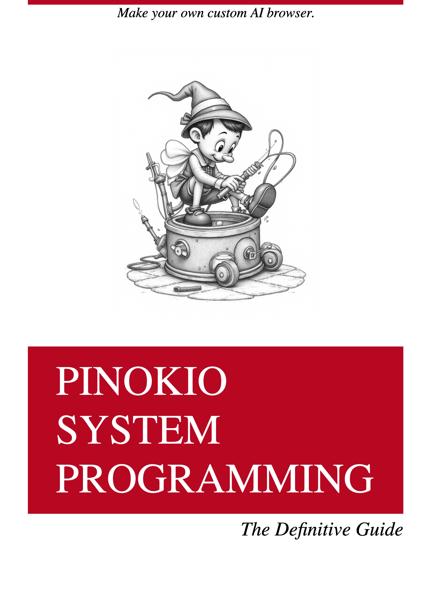

# PSP

> Pinokio System Programming



# Install

## 1. One-Click Install

**(Recommended)** Install this through https://pinokio.computer

1. Get PSP
2. Click "Install" to get started. This will copy the ocntents of the [web](web) folder into your `~/pinokio/web` path.

To customize, try experimenting with the contents of the `~/pinokio/web` folder

To uninstall, click "uninstall". This should remove the `~/pinokio/weeb` folder, which will now rert back to using the default theme.

## 2. Manual Install

1. Go to your pinokio home folder (for example `~/pinokio`)
2. Copy the contents of the [web](web) folder under `~/pinokio` so the folder structure would look like this:

```
~/pinokio
  /api
    <app1>
    <app2>
    ...
  /bin
  /cache
  /drive
  /logs
  /web            <= Copy & paste the web folder here
    /public
      app.css
      bg.jpeg
      icon.png
      popperjs.js
      tippy.css
      tippy.js
    /views
      index.ejs
    config.json
```
